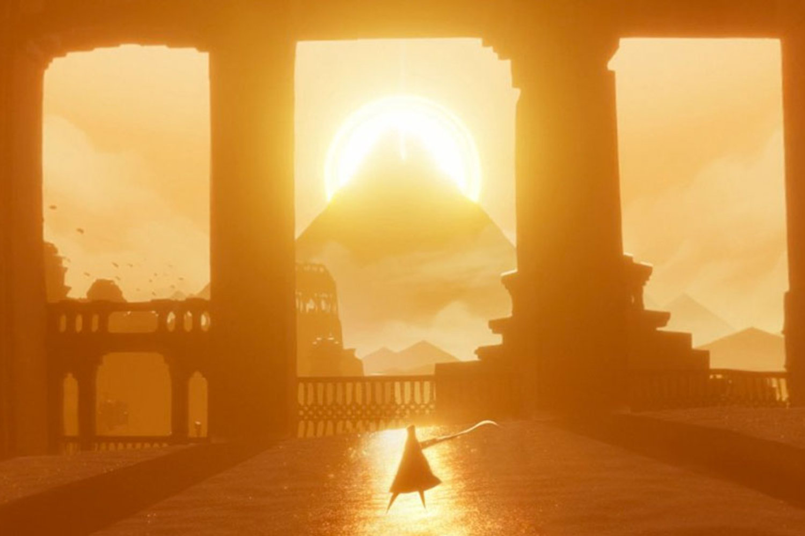

# 关于这本书
## 引言

<canvas id="custom" class="canvas" data-fragment-url="cmyk-halftone.frag" data-textures="vangogh.jpg" width="700px" height="320px"></canvas>

上面两幅图是由不同的方式制成的。第一张是梵高一层一层徒手画出来的，需要花费些时间。第二张则是用 4 个像素矩阵分秒钟生成的：一个青色，一个品红，一个黄色，和一个黑色矩阵。关键的区别在于第二张图是用非序列方式实现的（即不是一步一步实现，而是多个同时进行）。

这本书是关于这个革命性的计算机技术，片段着色器（fragment shaders），它将数字生成的图像提到了新的层次。你可以把它看做当年的古腾堡印刷术。

Fragment shaders（片段着色器）可以让你控制像素在屏幕上的快速渲染。这就是它在各种场合被广泛使用的原因，从手机的视频滤镜到酷炫的的3D视频游戏。

在接下来的章节你会发现这项技术是多么难以置信地快速和强大，还有如何将它应用到专业的和个人的作品中。

## 这本书是为谁而写的？

这本书是写给有代码经验和线性代数、三角学的基本知识的创意编程者、游戏开发者和工程师的，还有那些想要提升他们的作品的图像质量到一个令人激动的新层次的人。（如果你想要学习编程，我强烈推荐你先学习[Processing](https://processing.org/)，等你玩起来processing，再回来看这个）。

这本书会教你如何使用 shaders（着色器）并把它整合进你的项目里，以提升作品的表现力和图形质量。因为GLSL（OpenGL的绘制语言）的shaders 在很多平台都可以编译和运行，你将可以把在这里学的运用到任何使用OpenGL, OpenGL ES 和 WebGL 的环境中。也就是说，你将可以把学到的知识应用到[Processing](https://processing.org/)，[openFrameworks](http://openframeworks.cc/)，[Cinder](http://libcinder.org/)，[Three.js](http://threejs.org/)和iOS/Android游戏中。

## 这本书包含哪些内容？

这本书专门关于 GLSL pixel shaders。首先我们会给出shaders的定义；然后我们会学习如何制作程序里的形状，图案，材质，和与之相关的动画。你将会学到基础的着色语言并把它们应用到有用的情景中，比如：图像处理（图像运算，矩阵卷积，模糊，颜色滤镜，查找表及其他效果）和模拟（Conway 的生命游戏，Gray-Scott 反应扩散，水波，水彩效果，Voronoi 细胞等等）。到书的最后我们将看到一系列基于光线跟踪（Ray Marching）的进阶技术。

**每章都会有可以玩的交互的例子。**当你改动代码的时候，你会立刻看到这些变化。一些概念可能会晦涩难懂，而这些可交互的例子会对你学习这些材料非常有益。你越快把这些代码付诸实践，你学习的过程就会越容易。

这本书里不包括的内容有：

* 这**不是**一本 openGL 或 webGL 的书。OpenGL/webGL 是一个比GLSL 或 fragment shaders 更大的主题。如果你想要学习 openGL/webGL 推荐看： [OpenGL Introduction](https://open.gl/introduction), [the 8th edition of the OpenGL Programming Guide](http://www.amazon.com/OpenGL-Programming-Guide-Official-Learning/dp/0321773039/ref=sr_1_1?s=books&ie=UTF8&qid=1424007417&sr=1-1&keywords=open+gl+programming+guide) (也被叫做红宝书) 或 [WebGL: Up and Running](http://www.amazon.com/WebGL-Up-Running-Tony-Parisi/dp/144932357X/ref=sr_1_4?s=books&ie=UTF8&qid=1425147254&sr=1-4&keywords=webgl)
。

* 这**不是**一本数学书。虽然我们会涉及到很多关于线代和三角学的算法和技术，但我们不会详细解释它。关于数学的问题我推荐手边备一本：[3rd Edition of Mathematics for 3D Game Programming and computer Graphics](http://www.amazon.com/Mathematics-Programming-Computer-Graphics-Third/dp/1435458869/ref=sr_1_1?ie=UTF8&qid=1424007839&sr=8-1&keywords=mathematics+for+games) 或 [2nd Edition of Essential Mathematics for Games and Interactive Applications](http://www.amazon.com/Essential-Mathematics-Games-Interactive-Applications/dp/0123742978/ref=sr_1_1?ie=UTF8&qid=1424007889&sr=8-1&keywords=essentials+mathematics+for+developers)。

## 开始学习需要什么准备？

没什么。如果你有可以运行 WebGL 的浏览器（像Chrome，Firefox或Safari）和网络，点击页面底端的“下一章”按钮就可以开始了。

此外，基于你有的条件或需求你可以：

* [制作一个离线版的本书](https://thebookofshaders.com/appendix/00/?lan=ch)

* [用不带浏览器的树莓派来运行书中示例](https://thebookofshaders.com/appendix/01/?lan=ch)

* [做一个PDF版的书用于打印](https://thebookofshaders.com/appendix/02/?lan=ch)

* 用[github仓库](https://github.com/patriciogonzalezvivo/thebookofshaders)来帮助解决问题和分享代码

# 开始
## 什么是 Fragment Shader(片段着色器)？

在之前的章节我们把 shaders 和古腾堡印刷术相提并论。为什么这样类比呢？更重要的是，什么是 shader？

如果你曾经有用计算机绘图的经验，你就知道在这个过程中你需要画一个圆，然后一个长方形，一条线，一些三角形……直到画出你想要的图像。这个过程很像用手写一封信或一本书 —— 都是一系列的指令，需要你一件一件完成。

Shaders 也是一系列的指令，但是这些指令会对屏幕上的每个像素同时下达。也就是说，你的代码必须根据像素在屏幕上的不同位置执行不同的操作。就像活字印刷，你的程序就像一个 function（函数），输入位置信息，输出颜色信息，当它编译完之后会以相当快的速度运行。

## 为什么 shaders 运行特别快？

为了回答这个问题，不得不给大家介绍**并行处理**（parallel processing）的神奇之处。

想象你的 CPU 是一个大的工业管道，然后每一个任务都是通过这个管道的某些东西 —— 就像一个生产流水线那样。有些任务要比别的大，也就是说要花费更多时间和精力去处理。我们就称它要求更强的处理能力。由于计算机自身的架构，这些任务需要串行；即一次一个地依序完成。现代计算机通常有一组四个处理器，就像这个管道一样运行，一个接一个地处理这些任务，从而使计算机流畅运行。每个管道通常被称为**线程**。

视频游戏和其他图形应用比起别的程序来说，需要高得多的处理能力。因为它们的图形内容需要操作无数像素。想想看，屏幕上的每一个像素都需要计算，而在 3D 游戏中几何和透视也都需要计算。

让我们回到开始那个关于管道和任务的比喻。屏幕上的每个像素都代表一个最简单的任务。单独来看完成任何一个像素的任务对 CPU 来说都很容易，那么问题来了，屏幕上的每一个像素都需要解决这样的小任务！也就是说，哪怕是对于一个老式的屏幕（分辨率 800x600）来说，都需要每帧处理480000个像素，即每秒进行14400000次计算！是的，这对于微处理器就是大问题了！而对于一个现代的 2800x1800 视网膜屏，每秒运行60帧，就需要每秒进行311040000次计算。图形工程师是如何解决这个问题的？

这个时候，并行处理就是最好的解决方案。比起用三五个强大的微处理器（或者说“管道”）来处理这些信息，用一大堆小的微处理器来并行计算，就要好得多。这就是图形处理器（GPU : Graphic Processor Unit)的来由。

设想一堆小型微处理器排成一个平面的画面，假设每个像素的数据是乒乓球。14400000个乒乓球可以在一秒内阻塞几乎任何管道。但是一面800x600的管道墙，每秒接收30波480000个像素的信息就可以流畅完成。这在更高的分辨率下也是成立的 —— 并行的处理器越多，可以处理的数据流就越大。

另一个 GPU 的魔法是特殊数学函数可通过硬件加速。非常复杂的数学操作可以直接被微芯片解决，而无须通过软件。这就表示可以有更快的三角和矩阵运算 —— 和电流一样快。

## GLSL是什么？

GLSL 代表 openGL Shading Language，openGL 着色语言，这是你在接下来章节看到的程序所遵循的具体标准。根据硬件和操作系统的不同，还有其他的着色器（shaders)。这里我们将依照[Khronos Group](https://www.khronos.org/opengl/)的规则来执行。了解 OpenGL 的历史将有助于你理解大多数奇怪的约定，所以建议不妨阅读[openglbook.com/chapter-0-preface-what-is-opengl.html](http://openglbook.com/chapter-0-preface-what-is-opengl.html)。

## 为什么 Shaders 有名地不好学？

就像蜘蛛侠里的那句名言，能力越大责任越大，并行计算也是如此；GPU 的强大的架构设计也有其限制与不足。

为了能使许多管线并行运行，每一个线程必须与其他的相独立。我们称这些线程对于其他线程在进行的运算是“盲视”的。这个限制就会使得所有数据必须以相同的方向流动。所以就不可能检查其他线程的输出结果，修改输入的数据，或者把一个线程的输出结果输入给另一个线程。允许数据在线程之间线程流动会使数据的整体性面临威胁。

并且 GPU 会让所有并行的微处理器（管道们）一直处在忙碌状态；只要它们一有空闲就会接到新的信息。一个线程不可能知道它前一刻在做什么。它可能是在画操作系统界面上的一个按钮，然后渲染了游戏中的一部分天空，然后显示了一封 email 中的一些文字。每个线程不仅是“盲视”的，而且还是“无记忆”的。同时，它要求编写一个通用的规则，依据像素的不同位置依次输出不同的结果。这种抽象性，和盲视、无记忆的限制使得 shaders 在程序员新手中不是很受欢迎。

但是不要担心！在接下来的章节中，我们会一步一步地，由浅入深地学习着色语言。如果你是在用一个靠谱的浏览器阅读这个教程，你会喜欢边读边玩书中的示例的。好了，不要再浪费时间了，赶快去玩起来吧！ 点击 **Next >>** 开启 shader 之旅！
