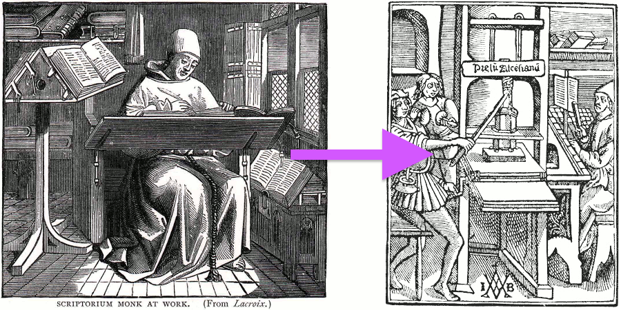
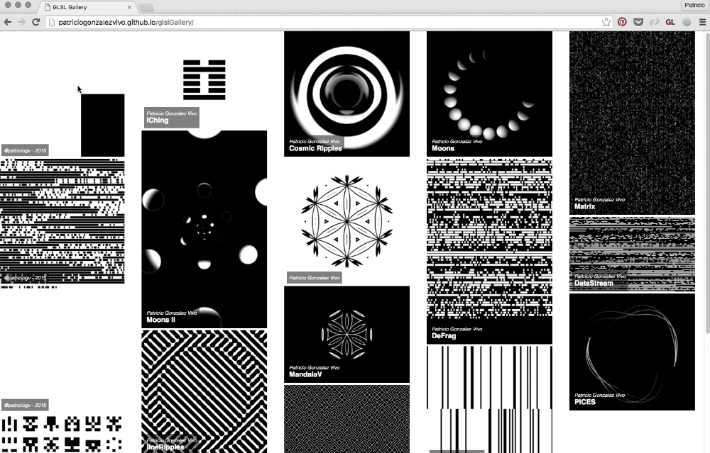
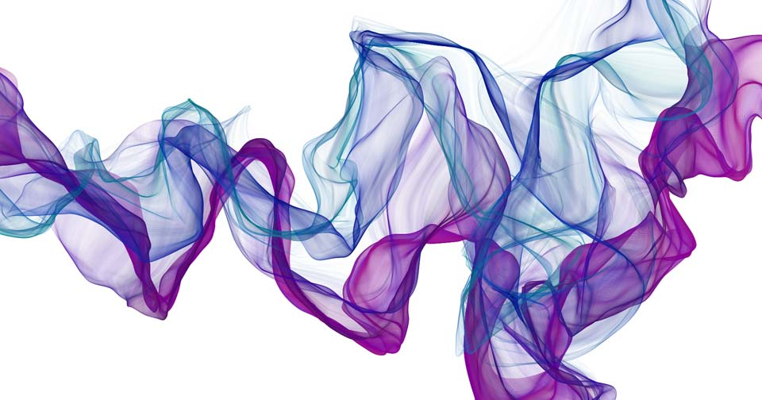
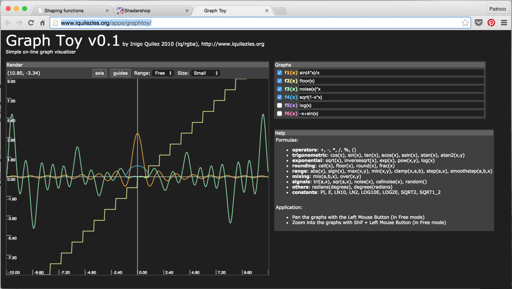

# 关于这本书
## 引言

<canvas id="custom" class="canvas" data-fragment-url="cmyk-halftone.frag" data-textures="vangogh.jpg" width="700px" height="320px"></canvas>

上面两幅图是由不同的方式制成的。第一张是梵高一层一层徒手画出来的，需要花费些时间。第二张则是用 4 个像素矩阵分秒钟生成的：一个青色，一个品红，一个黄色，和一个黑色矩阵。关键的区别在于第二张图是用非序列方式实现的（即不是一步一步实现，而是多个同时进行）。

这本书是关于这个革命性的计算机技术，片段着色器（fragment shaders），它将数字生成的图像提到了新的层次。你可以把它看做当年的古腾堡印刷术。


Fragment shaders（片段着色器）可以让你控制像素在屏幕上的快速渲染。这就是它在各种场合被广泛使用的原因，从手机的视频滤镜到酷炫的的3D视频游戏。


在接下来的章节你会发现这项技术是多么难以置信地快速和强大，还有如何将它应用到专业的和个人的作品中。


## 这本书是为谁而写的？

这本书是写给有代码经验和线性代数、三角学的基本知识的创意编程者、游戏开发者和工程师的，还有那些想要提升他们的作品的图像质量到一个令人激动的新层次的人。（如果你想要学习编程，我强烈推荐你先学习[Processing](https://processing.org/)，等你玩起来processing，再回来看这个）。

这本书会教你如何使用 shaders（着色器）并把它整合进你的项目里，以提升作品的表现力和图形质量。因为GLSL（OpenGL的绘制语言）的shaders 在很多平台都可以编译和运行，你将可以把在这里学的运用到任何使用OpenGL, OpenGL ES 和 WebGL 的环境中。也就是说，你将可以把学到的知识应用到[Processing](https://processing.org/)，[openFrameworks](http://openframeworks.cc/)，[Cinder](http://libcinder.org/)，[Three.js](http://threejs.org/)和iOS/Android游戏中。


## 这本书包含哪些内容？

这本书专门关于 GLSL pixel shaders。首先我们会给出shaders的定义；然后我们会学习如何制作程序里的形状，图案，材质，和与之相关的动画。你将会学到基础的着色语言并把它们应用到有用的情景中，比如：图像处理（图像运算，矩阵卷积，模糊，颜色滤镜，查找表及其他效果）和模拟（Conway 的生命游戏，Gray-Scott 反应扩散，水波，水彩效果，Voronoi 细胞等等）。到书的最后我们将看到一系列基于光线跟踪（Ray Marching）的进阶技术。

**每章都会有可以玩的交互的例子。**当你改动代码的时候，你会立刻看到这些变化。一些概念可能会晦涩难懂，而这些可交互的例子会对你学习这些材料非常有益。你越快把这些代码付诸实践，你学习的过程就会越容易。

这本书里不包括的内容有：

* 这**不是**一本 openGL 或 webGL 的书。OpenGL/webGL 是一个比GLSL 或 fragment shaders 更大的主题。如果你想要学习 openGL/webGL 推荐看： [OpenGL Introduction](https://open.gl/introduction), [the 8th edition of the OpenGL Programming Guide](http://www.amazon.com/OpenGL-Programming-Guide-Official-Learning/dp/0321773039/ref=sr_1_1?s=books&ie=UTF8&qid=1424007417&sr=1-1&keywords=open+gl+programming+guide) (也被叫做红宝书) 或 [WebGL: Up and Running](http://www.amazon.com/WebGL-Up-Running-Tony-Parisi/dp/144932357X/ref=sr_1_4?s=books&ie=UTF8&qid=1425147254&sr=1-4&keywords=webgl)
。

* 这**不是**一本数学书。虽然我们会涉及到很多关于线代和三角学的算法和技术，但我们不会详细解释它。关于数学的问题我推荐手边备一本：[3rd Edition of Mathematics for 3D Game Programming and computer Graphics](http://www.amazon.com/Mathematics-Programming-Computer-Graphics-Third/dp/1435458869/ref=sr_1_1?ie=UTF8&qid=1424007839&sr=8-1&keywords=mathematics+for+games) 或 [2nd Edition of Essential Mathematics for Games and Interactive Applications](http://www.amazon.com/Essential-Mathematics-Games-Interactive-Applications/dp/0123742978/ref=sr_1_1?ie=UTF8&qid=1424007889&sr=8-1&keywords=essentials+mathematics+for+developers)。

## 开始学习需要什么准备？

没什么。如果你有可以运行 WebGL 的浏览器（像Chrome，Firefox或Safari）和网络，点击页面底端的“下一章”按钮就可以开始了。

此外，基于你有的条件或需求你可以：

* [制作一个离线版的本书](https://thebookofshaders.com/appendix/00/?lan=ch)

* [用不带浏览器的树莓派来运行书中示例](https://thebookofshaders.com/appendix/01/?lan=ch)

* [做一个PDF版的书用于打印](https://thebookofshaders.com/appendix/02/?lan=ch)

* 用[github仓库](https://github.com/patriciogonzalezvivo/thebookofshaders)来帮助解决问题和分享代码


# 开始
## 什么是 Fragment Shader(片段着色器)？

在之前的章节我们把 shaders 和古腾堡印刷术相提并论。为什么这样类比呢？更重要的是，什么是 shader？



如果你曾经有用计算机绘图的经验，你就知道在这个过程中你需要画一个圆，然后一个长方形，一条线，一些三角形……直到画出你想要的图像。这个过程很像用手写一封信或一本书 —— 都是一系列的指令，需要你一件一件完成。

Shaders 也是一系列的指令，但是这些指令会对屏幕上的每个像素同时下达。也就是说，你的代码必须根据像素在屏幕上的不同位置执行不同的操作。就像活字印刷，你的程序就像一个 function（函数），输入位置信息，输出颜色信息，当它编译完之后会以相当快的速度运行。


## 为什么 shaders 运行特别快？

为了回答这个问题，不得不给大家介绍**并行处理**（parallel processing）的神奇之处。

想象你的 CPU 是一个大的工业管道，然后每一个任务都是通过这个管道的某些东西 —— 就像一个生产流水线那样。有些任务要比别的大，也就是说要花费更多时间和精力去处理。我们就称它要求更强的处理能力。由于计算机自身的架构，这些任务需要串行；即一次一个地依序完成。现代计算机通常有一组四个处理器，就像这个管道一样运行，一个接一个地处理这些任务，从而使计算机流畅运行。每个管道通常被称为**线程**。


视频游戏和其他图形应用比起别的程序来说，需要高得多的处理能力。因为它们的图形内容需要操作无数像素。想想看，屏幕上的每一个像素都需要计算，而在 3D 游戏中几何和透视也都需要计算。

让我们回到开始那个关于管道和任务的比喻。屏幕上的每个像素都代表一个最简单的任务。单独来看完成任何一个像素的任务对 CPU 来说都很容易，那么问题来了，屏幕上的每一个像素都需要解决这样的小任务！也就是说，哪怕是对于一个老式的屏幕（分辨率 800x600）来说，都需要每帧处理480000个像素，即每秒进行14400000次计算！是的，这对于微处理器就是大问题了！而对于一个现代的 2800x1800 视网膜屏，每秒运行60帧，就需要每秒进行311040000次计算。图形工程师是如何解决这个问题的？


这个时候，并行处理就是最好的解决方案。比起用三五个强大的微处理器（或者说“管道”）来处理这些信息，用一大堆小的微处理器来并行计算，就要好得多。这就是图形处理器（GPU : Graphic Processor Unit)的来由。


设想一堆小型微处理器排成一个平面的画面，假设每个像素的数据是乒乓球。14400000个乒乓球可以在一秒内阻塞几乎任何管道。但是一面800x600的管道墙，每秒接收30波480000个像素的信息就可以流畅完成。这在更高的分辨率下也是成立的 —— 并行的处理器越多，可以处理的数据流就越大。

另一个 GPU 的魔法是特殊数学函数可通过硬件加速。非常复杂的数学操作可以直接被微芯片解决，而无须通过软件。这就表示可以有更快的三角和矩阵运算 —— 和电流一样快。

## GLSL是什么？

GLSL 代表 openGL Shading Language，openGL 着色语言，这是你在接下来章节看到的程序所遵循的具体标准。根据硬件和操作系统的不同，还有其他的着色器（shaders)。这里我们将依照[Khronos Group](https://www.khronos.org/opengl/)的规则来执行。了解 OpenGL 的历史将有助于你理解大多数奇怪的约定，所以建议不妨阅读[openglbook.com/chapter-0-preface-what-is-opengl.html](http://openglbook.com/chapter-0-preface-what-is-opengl.html)。

## 为什么 Shaders 有名地不好学？

就像蜘蛛侠里的那句名言，能力越大责任越大，并行计算也是如此；GPU 的强大的架构设计也有其限制与不足。

为了能使许多管线并行运行，每一个线程必须与其他的相独立。我们称这些线程对于其他线程在进行的运算是“盲视”的。这个限制就会使得所有数据必须以相同的方向流动。所以就不可能检查其他线程的输出结果，修改输入的数据，或者把一个线程的输出结果输入给另一个线程。允许数据在线程之间线程流动会使数据的整体性面临威胁。

并且 GPU 会让所有并行的微处理器（管道们）一直处在忙碌状态；只要它们一有空闲就会接到新的信息。一个线程不可能知道它前一刻在做什么。它可能是在画操作系统界面上的一个按钮，然后渲染了游戏中的一部分天空，然后显示了一封 email 中的一些文字。每个线程不仅是“盲视”的，而且还是“无记忆”的。同时，它要求编写一个通用的规则，依据像素的不同位置依次输出不同的结果。这种抽象性，和盲视、无记忆的限制使得 shaders 在程序员新手中不是很受欢迎。

但是不要担心！在接下来的章节中，我们会一步一步地，由浅入深地学习着色语言。如果你是在用一个靠谱的浏览器阅读这个教程，你会喜欢边读边玩书中的示例的。好了，不要再浪费时间了，赶快去玩起来吧！ 点击 **Next >>** 开启 shader 之旅！


## Hello World

“Hello world!”通常都是学习一个新语言的第一个例子。这是一个非常简单，只有一行的程序。它既是一个热情的欢迎，也传达了编程所能带来的可能性。

然而在 GPU 的世界里，第一步就渲染一行文字太难了，所以我们改为选择一个鲜艳的欢迎色，来吧躁起来！

<div class="codeAndCanvas" data="hello_world.frag"></div>

如果你是在线阅读这本书的话，上面的代码都是可以交互的。你可以点击或者改动代码中任何一部分，尽情探索。多亏 GPU 的架构，shader 会**飞速**地编译和更新，这使得你的改动都会立刻出现在你眼前。试试改动第 8 行的值，看会发生什么。

尽管这几行简单的代码看起来不像有很多内容，我们还是可以据此推测出一些知识点：

1. shader 语言 有一个  ```main``` 函数，会在最后返回颜色值。这点和 C 语言很像。

2. 最终的像素颜色取决于预设的全局变量 ```gl_FragColor```。

3. 这个类 C 语言有内建的**变量**（像```gl_FragColor```），**函数**和**数据类型**。在本例中我们刚刚介绍了```vec4```（四分量浮点向量）。之后我们会见到更多的类型，像 ```vec3``` （三分量浮点向量）和 ```vec2``` （二分量浮点向量），还有非常著名的：```float```（单精度浮点型）， ```int```（整型） 和 ```bool```（布尔型）。

4. 如果我们仔细观察 ```vec4``` 类型，可以推测这四个变元分别响应红，绿，蓝和透明度通道。同时我们也可以看到这些变量是**规范化**的，意思是它们的值是从0到1的。之后我们会学习如何规范化变量，使得在变量间**map**（映射）数值更加容易。

5. 另一个可以从本例看出来的很重要的类 C 语言特征是，预处理程序的宏指令。宏指令是预编译的一部分。有了宏才可以 ```#define``` （定义）全局变量和进行一些基础的条件运算（通过使用 ```#ifdef``` 和 ```#endif```）。所有的宏都以 ```#``` 开头。预编译会在编译前一刻发生，把所有的命令复制到 ```#defines``` 里，检查```#ifdef``` 条件句是否已被定义， ```#ifndef``` 条件句是否没有被定义。在我们刚刚的“hello world!”的例子中，如果定义了```GL_ES```这个变量，才会插入运行第2行的代码，这个通常用在移动端或浏览器的编译中。

6. ```float```类型在 shaders 中非常重要，所以**精度**非常重要。更低的精度会有更快的渲染速度，但是会以质量为代价。你可以选择每一个浮点值的精度。在第一行（```precision mediump float;```）我们就是设定了所有的浮点值都是中等精度。但我们也可以选择把这个值设为“低”（```precision lowp float;```）或者“高”（```precision highp float;```）。

7. 最后可能也是最重要的细节是，GLSL 语言规范并不保证变量会被自动转换类别。这句话是什么意思呢？显卡的硬件制造商各有不同的显卡加速方式，但是却被要求有最精简的语言规范。因而，自动强制类型转换并没有包括在其中。在我们的“hello world!”例子中，```vec4``` 精确到单精度浮点，所以应被赋予 ```float``` 格式。但是如果你想要代码前后一致，不要之后花费大量时间 debug 的话，最好养成在 ```float``` 型数值里加一个 ```.``` 的好习惯。如下这种代码就可能不能正常运行：

```glsl
void main() {
	gl_FragColor = vec4(1,0,0,1);	// 出错
}
```

现在我们已经基本讨论完了“hello world!”例子中所有主要的内容，是时候点击代码，检验一下我们所学的知识了。你会发现出错时程序会编译失败，只留一个寂寞的白屏。你可以试试一些好玩的小点子，比如说：

* 把单精度浮点值换成整型数值，猜猜你的显卡能不能容忍这个行为。

* 试试把第八行注释掉，不给函数赋任何像素的值。

* 尝试另外写个函数，返回某个颜色，然后在 ```main()``` 里面使用这个函数。给个提示，这个函数应该长这样：

```glsl
vec4 red(){
    return vec4(1.0,0.0,0.0,1.0);
}
```

* 有很多种构造 ```vec4``` 类型的方式，试试看其他方式。下面就是其中一种方式：

```glsl
vec4 color = vec4(vec3(1.0,0.0,1.0),1.0);
```

尽管这个例子看起来不那么刺激，它却是最最基础的 —— 我们把画布上的每一个像素都改成了一个确切的颜色。在接下来的章节中我们将会看到如何用两种输入源来改变像素的颜色：空间（依据像素在屏幕上的位置）和时间（依据页面加载了多少秒）。


## Uniforms

现在我们知道了 GPU 如何处理并行线程，每个线程负责给完整图像的一部分配置颜色。尽管每个线程和其他线程之间不能有数据交换，但我们能从 CPU 给每个线程输入数据。因为显卡的架构，所有线程的输入值必须**统一**（uniform），而且必须设为**只读**。也就是说，每条线程接收相同的数据，并且是不可改变的数据。

这些输入值叫做 ```uniform``` （统一值），它们的数据类型通常为：```float```, ```vec2```, ```vec3```, ```vec4```, ```mat2```, ```mat3```, ```mat4```, ```sampler2D``` and ```samplerCube```。uniform 值需要数值类型前后一致。且在 shader 的开头，在设定精度之后，就对其进行定义。

```glsl
#ifdef GL_ES
precision mediump float;
#endif

uniform vec2 u_resolution; // 画布尺寸（宽，高）
uniform vec2 u_mouse;      // 鼠标位置（在屏幕上哪个像素）
uniform float u_time;	  // 时间（加载后的秒数）
```

你可以把 uniforms 想象成连通 GPU 和 CPU 的许多小的桥梁。虽然这些 uniforms 的名字千奇百怪，但是在这一系列的例子中我一直有用到：```u_time``` （时间）, ```u_resolution``` （画布尺寸）和 ```u_mouse``` （鼠标位置）。按业界传统应在 uniform 值的名字前加 ```u_``` ，这样一看即知是 uniform。尽管如此你也还会见到各种各样的名字。比如[ShaderToy.com](https://www.shadertoy.com/)就用了如下的名字：

```glsl
uniform vec3 iResolution;   // 视口分辨率（以像素计）
uniform vec4 iMouse;        // 鼠标坐标 xy： 当前位置, zw： 点击位置
uniform float iTime;        // shader 运行时间（以秒计）
```

好了说的足够多了，我们来看看实际操作中的 uniform 吧。在下面的代码中我们使用  ```u_time``` 加上一个 sin 函数，来展示图中红色的动态变化。

<div class="codeAndCanvas" data="time.frag"></div>

GLSL 还有更多惊喜。GPU 的硬件加速支持我们使用角度，三角函数和指数函数。这里有一些这些函数的介绍：[```sin()```](../glossary/?search=sin), [```cos()```](../glossary/?search=cos), [```tan()```](../glossary/?search=tan), [```asin()```](../glossary/?search=asin), [```acos()```](../glossary/?search=acos), [```atan()```](../glossary/?search=atan), [```pow()```](../glossary/?search=pow), [```exp()```](../glossary/?search=exp), [```log()```](../glossary/?search=log), [```sqrt()```](../glossary/?search=sqrt), [```abs()```](../glossary/?search=abs), [```sign()```](../glossary/?search=sign), [```floor()```](../glossary/?search=floor), [```ceil()```](../glossary/?search=ceil), [```fract()```](../glossary/?search=fract), [```mod()```](../glossary/?search=mod), [```min()```](../glossary/?search=min), [```max()```](../glossary/?search=max) 和 [```clamp()```](../glossary/?search=clamp)。

现在又到你来玩的时候了。

* 降低颜色变化的速率，直到肉眼都看不出来。

* 加速变化，直到颜色静止不动。

* 玩一玩 RGB 三个通道，分别给三个颜色不同的变化速度，看看能不能做出有趣的效果。

## gl_FragCoord

就像 GLSL 有个默认输出值 ```vec4 gl_FragColor``` 一样，它也有一个默认输入值（ ```vec4 gl_FragCoord``` ）。``` gl_FragCoord```存储了活动线程正在处理的**像素**或**屏幕碎片**的坐标。有了它我们就知道了屏幕上的哪一个线程正在运转。为什么我们不叫 ``` gl_FragCoord``` uniform （统一值）呢？因为每个像素的坐标都不同，所以我们把它叫做 **varying**（变化值）。

<div class="codeAndCanvas" data="space.frag"></div>

上述代码中我们用 ```gl_FragCoord.xy``` 除以 ```u_resolution```，对坐标进行了**规范化**。这样做是为了使所有的值落在 ```0.0``` 到 ```1.0``` 之间，这样就可以轻松把 X 或 Y 的值映射到红色或者绿色通道。

在 shader 的领域我们没有太多要 debug 的，更多地是试着给变量赋一些很炫的颜色，试图做出一些效果。有时你会觉得用 GLSL 编程就像是把一搜船放到了瓶子里。它同等地困难、美丽而令人满足。


现在我们来检验一下我们对上面代码的理解程度。

* 你明白 ```(0.0,0.0)``` 坐标在画布上的哪里吗？

* 那 ```(1.0,0.0)```, ```(0.0,1.0)```, ```(0.5,0.5)``` 和 ```(1.0,1.0)``` 呢？

* 你知道如何用**未**规范化（normalized）的 ```u_mouse``` 吗？你可以用它来移动颜色吗？

* 你可以用 ```u_time``` 和 ```u_mouse``` 来改变颜色的图案吗？不妨琢磨一些有趣的途径。

经过这些小练习后，你可能会好奇还能用强大的 shader 做什么。接下来的章节你会知道如何把你的 shader 和 three.js，Processing，和 openFrameworks 结合起来。


## 运行你的 shader

我制作了一套工具生态系统，用于创建、显示、分享与使用 shader，以此作为本书结构及我艺术实践的一部分。这些工具是跨平台的，无需更改代码就能在 Linux、MacOS、Windows、[树莓派](https://www.raspberrypi.org/) 和浏览器上表现一致。

## 在浏览器上运行你的 shader

**显示**: 本书中所有实例都可以用 [glslCanvas](https://github.com/patriciogonzalezvivo/glslCanvas) 来显示，这样一来，运行独立的 shader 程序就变得非常简单.

```html
<canvas class="glslCanvas" data-fragment-url=“yourShader.frag" data-textures=“yourInputImage.png” width="500" height="500"></canvas>
```

如你所见, 只需要创建一个类名为 `class="glslCanvas"` 的 `canvas` 元素，并将你的 shader 链接放在  `data-fragment-url` 中. 在 [这里](https://github.com/patriciogonzalezvivo/glslCanvas) 可以了解更多.

你可能会像我一样想要从命令行直接运行 shader，那你需要看看 [glslViewer](https://github.com/patriciogonzalezvivo/glslViewer)。这个应用程序可以将 shader 放到  `bash` 脚本或 unix 管道里，并且像 [ImageMagick](http://www.imagemagick.org/script/index.php) 一样使用它。此外，[glslViewer](https://github.com/patriciogonzalezvivo/glslViewer) 也是一个在 [树莓派](https://www.raspberrypi.org/) 上编译 shader 的好办法, 这就是 [openFrame.io](http://openframe.io/) 用它来展示shader 作品的原因。在 [这里](https://github.com/patriciogonzalezvivo/glslViewer) 可以了解该应用程序的更多信息。

```bash
glslViewer yourShader.frag yourInputImage.png —w 500 -h 500 -s 1 -o yourOutputImage.png
```

**创建**: 为了介绍 shader 编码的经验，我制作了在线编辑器 [glslEditor](https://github.com/patriciogonzalezvivo/glslEditor)。本书的实例中内嵌了这个编辑器。这个编辑器有很多好用的小组件，使编写 glsl 代码的体验更加直观。你也可以在 [editor.thebookofshaders.com/](http://editor.thebookofshaders.com/) 上将其作为独立的 Web 应用运行。在 [这里](https://github.com/patriciogonzalezvivo/glslEditor) 了解更多。


如果你更喜欢用 [SublimeText](https://www.sublimetext.com/) 离线编程，你可以安装 [package for glslViewer](https://packagecontrol.io/packages/glslViewer)。 在 [这里](https://github.com/patriciogonzalezvivo/sublime-glslViewer) 了解更多.


**分享**: 在线编辑器 ([editor.thebookofshaders.com/](http://editor.thebookofshaders.com/)) 可以分享你的 shader！内嵌版和独立版都有导出按钮，你可以通过这个按钮获得 shader 的唯一链接。编辑器也可以直接将 shader 导出到 [openFrame.io](http://openframe.io/)。


**使用**: 分享代码只是分享 shader 作品的开始！除了导出到 [openFrame.io](http://openframe.io/)，我还制作了使用 shader 的工具 [glslGallery](https://github.com/patriciogonzalezvivo/glslGallery)，它可以将 shader 放入画廊中，以便嵌入到任何网站. 在 [这里](https://github.com/patriciogonzalezvivo/glslGallery) 了解更多.



## 在你喜欢的框架上运行你的 shader

如果你使用过这些这些框架: [Processing](https://processing.org/), [Three.js](http://threejs.org/), [OpenFrameworks](http://openframeworks.cc/) 或 [SFML](https://www.sfml-dev.org/), 你可能更愿意在你觉得舒服的这些平台上编写 shader。下面将会介绍在这些框架中，用本书范式编写 shader 的方法。 (在 [本章节的 GitHub 仓库中](https://github.com/patriciogonzalezvivo/thebookofshaders/tree/master/04), 你能找到这三个框架的完整源码.)

### **Three.js**

为人谦逊而非常有才华的 Ricardo Cabello (也就是 [MrDoob](https://twitter.com/mrdoob) )和许多[贡献者](https://github.com/mrdoob/three.js/graphs/contributors) 一起搭了可能是 WebGL 最知名的平台，[Three.js](http://threejs.org/)。你可以找到无数程序示例，教程，书籍，教你如何用这个 JavaScript 库做出酷炫的 3D 图像。

下面是一个你需要的例子，教你用 three.js 玩转 shader。注意 ```id="fragmentShader"```脚本，你要把下面的代码拷到里面。

下面是一个 HTML 和 JS 的示例，

```html
<body>
    <div id="container"></div>
    <script src="js/three.min.js"></script>
    <script id="vertexShader" type="x-shader/x-vertex">
        void main() {
            gl_Position = vec4( position, 1.0 );
        }
    </script>
    <script id="fragmentShader" type="x-shader/x-fragment">
        uniform vec2 u_resolution;
        uniform float u_time;

        void main() {
            vec2 st = gl_FragCoord.xy/u_resolution.xy;
            gl_FragColor=vec4(st.x,st.y,0.0,1.0);
        }
    </script>
    <script>
        var container;
        var camera, scene, renderer, clock;
        var uniforms;

        init();
        animate();

        function init() {
            container = document.getElementById( 'container' );

            camera = new THREE.Camera();
            camera.position.z = 1;

            scene = new THREE.Scene();
            clock = new THREE.Clock();

            var geometry = new THREE.PlaneBufferGeometry( 2, 2 );

            uniforms = {
                u_time: { type: "f", value: 1.0 },
                u_resolution: { type: "v2", value: new THREE.Vector2() }
            };

            var material = new THREE.ShaderMaterial( {
                uniforms: uniforms,
                vertexShader: document.getElementById( 'vertexShader' ).textContent,
                fragmentShader: document.getElementById( 'fragmentShader' ).textContent
            } );

            var mesh = new THREE.Mesh( geometry, material );
            scene.add( mesh );

            renderer = new THREE.WebGLRenderer();
            renderer.setPixelRatio( window.devicePixelRatio );

            container.appendChild( renderer.domElement );

            onWindowResize();
            window.addEventListener( 'resize', onWindowResize, false );
        }

        function onWindowResize( event ) {
            renderer.setSize( window.innerWidth, window.innerHeight );
            uniforms.u_resolution.value.x = renderer.domElement.width;
            uniforms.u_resolution.value.y = renderer.domElement.height;
        }

        function animate() {
            requestAnimationFrame( animate );
            render();
        }

        function render() {
            uniforms.u_time.value += clock.getDelta();
            renderer.render( scene, camera );
        }
    </script>
</body>
```

### **Processing**

2001年由[Ben Fry](http://benfry.com/) 和 [Casey Reas](http://reas.com/) 创建，[Processing](https://processing.org/)是一个极其简约而强大的环境，非常适合初尝代码的人（至少对于我来是这样）。关于 OpenGL 和视频，[Andres Colubri](https://codeanticode.wordpress.com/)为 Processing 平台做了很重要的更新，使得环境非常友好，玩 GLSL shader 比起以前大大容易了。Processing 会在你的 sketch 的 ```data``` 文件夹搜索名为 ```"shader.frag"``` 的文件。记得把这里的示例代码拷到你的文件夹里然后重命名 shader。

```processing
PShader shader;

void setup() {
  size(640, 360, P2D);
  noStroke();

  shader = loadShader("shader.frag");
}

void draw() {
  shader.set("u_resolution", float(width), float(height));
  shader.set("u_mouse", float(mouseX), float(mouseY));
  shader.set("u_time", millis() / 1000.0);
  shader(shader);
  rect(0,0,width,height);
}
```

在 2.1 版之前的版本运行 shader，你需要在你的 shader 文件开头添加以下代码：
 ```#define PROCESSING_COLOR_SHADER```。所以它应该看起来是这样：
```glsl
#ifdef GL_ES
precision mediump float;
#endif

#define PROCESSING_COLOR_SHADER

uniform vec2 u_resolution;
uniform vec3 u_mouse;
uniform float u_time;

void main() {
    vec2 st = gl_FragCoord.st/u_resolution;
    gl_FragColor = vec4(st.x,st.y,0.0,1.0);
}
```

更多 Processing 的 shader 教程戳 [tutorial](https://processing.org/tutorials/pshader/)。

### **openFrameworks**

每个人都有自己的舒适区，我的则是[openFrameworks community](http://openframeworks.cc/)。这个 C++ 框架打包了 OpenGL 和其他开源 C++ 库。在很多方面它和 Processing 非常像，但是明显和 C++ 编译器打交道一定比较麻烦。和 Processing 很像地，openFrameworks 会在你的 data 文件夹里寻找 shader 文件，所以不要忘记把你的后缀 ```.frag``` 的文件拷进去，加载的时候记得改名。

```cpp
void ofApp::draw(){
    ofShader shader;
    shader.load("","shader.frag");

    shader.begin();
    shader.setUniform1f("u_time", ofGetElapsedTimef());
    shader.setUniform2f("u_resolution", ofGetWidth(), ofGetHeight());
    ofRect(0,0,ofGetWidth(), ofGetHeight());
    shader.end();
}
```

关于 shader 在 openFrameworks 的更多信息请参考这篇[excellent tutorial](http://openframeworks.cc/ofBook/chapters/shaders.html)，作者是 [Joshua Noble](http://thefactoryfactory.com/)。


# 算法绘画
## 造型函数

这一章应该叫做宫城先生的粉刷课（来自电影龙威小子的经典桥段）。之前我们把规范化后的 x,y 坐标映射（map）到了红色和绿色通道。本质上说我们是建造了这样一个函数：输入一个二维向量（x，y)，然后返回一个四维向量（r，g，b，a）。但在我们跨维度转换数据之前，我们先从更加…更加简单的开始。我们来建一个只有一维变量的函数。你花越多的时间和精力在这上面，你的 shader 功夫就越厉害。


接下来的代码结构就是我们的基本功。在它之中我们对规范化的 x 坐标（```st.x```）进行可视化。有两种途径：一种是用亮度（度量从黑色到白色的渐变过程），另一种是在顶层绘制一条绿色的线（在这种情况下 x 被直接赋值给 y）。不用过分在意绘制函数，我们马上会更加详细地解释它。

<div class="codeAndCanvas" data="linear.frag"></div>

**简注** ：```vec3``` 类型构造器“明白”你想要把一个值赋值到颜色的三个通道里，就像 ```vec4``` 明白你想要构建一个四维向量，三维向量加上第四个值（比如颜色的三个值加上透明度）。请参照上面示例的第 19 到 25 行。

这些代码就是你的基本功；遵守和理解它非常重要。你将会一遍又一遍地回到 0.0 到 1.0 这个区间。你将会掌握融合与构建这些代码的艺术。

这些 x 与 y（或亮度）之间一对一的关系称作**线性插值**（linear interpolation）。（译者注：插值是离散函数逼近的重要方法，利用它可通过函数在有限个点处的取值状况，估算出函数在其他点处的近似值。因为对计算机来说，屏幕像素是离散的而不是连续的，计算机图形学常用插值来填充图像像素之间的空隙。）现在起我们可以用一些数学函数来改造这些代码行。比如说我们可以做一个求 x 的 5 次幂的曲线。

<div class="codeAndCanvas" data="expo.frag"></div>

很有趣，对吧？试试看把第 19 行的指数改为不同的值，比如：20.0，2.0，1.0，0.0，0.2 或 0.02。理解值和指数之间的关系非常重要。这些数学函数可以让你灵动地控制你的代码，就像是给数据做针灸一样。

[```pow()```](../glossary/?search=pow) （求x的y次幂）是 GLSL 的一个原生函数，GLSL 有很多原生函数。大多数原生函数都是硬件加速的，也就是说如果你正确使用这些函数，你的代码就会跑得更快。

换掉第 19 行的幂函数，试试看[```exp()```](../glossary/?search=exp)（以自然常数e为底的指数函数），[```log()```](../glossary/?search=log)(对数函数) 和 [```sqrt()```](../glossary/?search=sqrt)（平方根函数）。当你用 Pi 来玩的时候有些方程会变得更有趣。在第 5 行我定义了一个宏，使得每当程序调用 ```PI``` 的时候就用 ```3.14159265359``` 来替换它。

### Step 和 Smoothstep

GLSL 还有一些独特的原生插值函数可以被硬件加速。

[```step()```](../glossary/?search=step) 插值函数需要输入两个参数。第一个是极限或阈值，第二个是我们想要检测或通过的值。对任何小于阈值的值，返回 ```0.0```，大于阈值，则返回 ```1.0```。

试试看改变下述代码中第 20 行的值。

<div class="codeAndCanvas" data="step.frag"></div>

另一个 GLSL 的特殊函数是 [```smoothstep()```](../glossary/?search=smoothstep)。当给定一个范围的上下限和一个数值，这个函数会在已有的范围内给出插值。前两个参数规定转换的开始和结束点，第三个是给出一个值用来插值。

<div class="codeAndCanvas" data="smoothstep.frag"></div>

在之前的例子中，注意第 12 行，我们用到 smoothstep 在 ```plot()``` 函数中画了一条绿色的线。这个函数会对给出的 x 轴上的每个值，在特定的 y 值处制造一个凹凸形变。如何做到呢？通过把两个 [```smoothstep()```](../glossary/?search=smoothstep) 连接到一起。来看看下面这个函数，用它替换上面的第 20 行，把它想成是一个垂直切割。背景看起来很像一条线，不是吗？

```glsl
    float y = smoothstep(0.2,0.5,st.x) - smoothstep(0.5,0.8,st.x);
```

### 正弦和余弦函数

当你想用数学来制造动效，形态或去混合数值，sin 和 cos 就是你的最佳伙伴。

这两个基础的三角函数是构造圆的极佳工具，就像张小泉的剪刀一样称手。很重要的一点是你需要知道它们是如何运转的，还有如何把它们结合起来。简单来说，当我们给出一个角度（这里采用弧度制），它就会返回半径为一的圆上一个点的 x 坐标（[cos](../glossary/?search=cos)）和 y 坐标（[sin](../glossary/?search=sin)）。正因为 sin 和 cos 返回的是规范化的值（即值域在 -1 和 1 之间），且如此流畅，这就使得它成为一个极其强大的工具。


尽管描述三角函数和圆的关系是一件蛮困难的事情，上图动画很棒地做到了这一点，视觉化展现了它们之间的关系。

<div class="simpleFunction" data="y = sin(x);"></div>

仔细看 sin 曲线。观察 y 值是如何平滑地在 +1 和 -1 之间变化。就像之前章节关于的 time 的例子中，你可以用 [```sin()```](../glossary/?search=sin) 的有节奏的变动给其他东西加动效。如果你是在用浏览器阅读的话你可以改动上述公式，看看曲线会如何变动。(注：不要忘记每行最后要加分号！）

试试下面的小练习，看看会发生什么：

* 在 ```sin``` 里让 x 加上时间（```u_time```）。让sin 曲线随 x 轴**动起来**。

* 在 ```sin``` 里用 ```PI``` 乘以 x。注意 sin 曲线上下波动的两部分如何**收缩**了，现在 sin 曲线每两个整数循环一次。

* 在 ```sin``` 里用时间（	```u_time```)乘以 x。观察各阶段的循环如何变得越来越**频繁**。注意 u_time 可能已经变得非常大，使得图像难以辨认。

* 给 [```sin(x)```](../glossary/?search=sin)（注意不是 sin 里的 x）加 1.0。观察曲线是如何向上**移动**的，现在值域变成了 0.0 到 2.0。

* 给 [```sin(x)```](../glossary/?search=sin) 乘以 2.0。观察曲线大小如何**增大**两倍。

* 计算 ```sin(x)``` 的绝对值（[```abs()```](../glossary/?search=abs)）。现在它看起来就像一个**弹力球**的轨迹。

* 只选取 ```sin(x)``` 的小数部分（[```fract()```](../glossary/?search=fract)）。

* 使用向正无穷取整（[```ceil()```](../glossary/?search=ceil)）和向负无穷取整（[```floor()```](../glossary/?search=floor)），使得 sin 曲线变成只有 1 和 -1 的电子波。

### 其他有用的函数

最后一个练习中我们介绍了一些新函数。现在我们来一个一个试一遍。依次取消注释下列各行，理解这些函数，观察它们是如何运作的。你一定在奇怪……为什么要这么做呢？Google 一下“generative art”（生成艺术）你就知道了。要知道这些函数就是我们的栅栏。我们现在控制的是它在一维中的移动，上上下下。很快，我们就可以尝试二维、三维甚至四维了！



<div class="simpleFunction" data="y = mod(x,0.5); // 返回 x 对 0.5 取模的值
//y = fract(x); // 仅仅返回数的小数部分
//y = ceil(x);  // 向正无穷取整
//y = floor(x); // 向负无穷取整
//y = sign(x);  // 提取 x 的正负号
//y = abs(x);   // 返回 x 的绝对值
//y = clamp(x,0.0,1.0); // 把 x 的值限制在 0.0 到 1.0
//y = min(0.0,x);   // 返回 x 和 0.0 中的较小值
//y = max(0.0,x);   // 返回 x 和 0.0 中的较大值  "></div>

### 造型函数进阶

[Golan Levin](http://www.flong.com/) 写过关于更加复杂的造型函数的文档，非常有帮助。把它们引入 GLSL 是非常明智的选择，这将是你的代码的广阔的素材库

* [多项式造型函数（Polynomial Shaping Functions）: www.flong.com/archive/texts/code/shapers_poly](http://www.flong.com/archive/texts/code/shapers_poly/)

* [指数造型函数（Exponential Shaping Functions）: www.flong.com/archive/texts/code/shapers_exp](http://www.flong.com/archive/texts/code/shapers_exp/)

* [圆与椭圆的造型函数（Circular & Elliptical Shaping Functions）: www.flong.com/archive/texts/code/shapers_circ](http://www.flong.com/archive/texts/code/shapers_circ/)

* [贝塞尔和其他参数化造型函数（Bezier and Other Parametric Shaping Functions）: www.flong.com/archive/texts/code/shapers_bez](http://www.flong.com/archive/texts/code/shapers_bez/)

就像厨师自主选择辣椒和各种原料，数字艺术家和创意编程者往往钟情于使用他们自己的造型函数。

[Iñigo Quiles](http://www.iquilezles.org/) 收集了一套[有用的函数](http://www.iquilezles.org/www/articles/functions/functions.htm)。在看过[这篇文章](http://www.iquilezles.org/www/articles/functions/functions.htm)后，看看下列函数转换到 GLSL 的样子。注意那些细小的改变，比如给浮点数（float)加小数点“.”，给“C 系函数”换成它们在 GLSL 里的名字，比如不是用 ```powf()``` 而是用 ```pow()```：

* [Impulse](../edit.php#05/impulse.frag)
* [Cubic Pulse](../edit.php#05/cubicpulse.frag)
* [Exponential Step](../edit.php#05/expstep.frag)
* [Parabola](../edit.php#05/parabola.frag)
* [Power Curve](../edit.php#05/pcurve.frag)

给你们看些东西刺激一下斗志，这里有一个非常优雅的例子（作者是 [Danguafer](https://www.shadertoy.com/user/Danguafer)，造型函数的空手道黑带）。

<iframe width="800" height="450" frameborder="0" src="https://www.shadertoy.com/embed/XsXXDn?gui=true&t=10&paused=true" allowfullscreen></iframe>

在下一章我们会有一些新的进展。我们会先混合各种颜色，然后画些形状。

#### 练习

来看看 [Kynd](http://www.kynd.info/log/) 帮大家制作的公式表。看他如何结合各种函数及它们的属性，始终控制值的范围在 0.0 到 1.0。好了，现在是你自己练习的时候了！来试试这些函数，记住：熟能生巧。


#### 填充你的工具箱

这里有一些工具可以帮你更轻松地可视化这些函数。

* [GraphToy](http://www.iquilezles.org/apps/graphtoy/)：仍然是 [Iñigo Quilez](http://www.iquilezles.org) 为大家做的工具，用于在 WebGL 中可视化 GLSL 函数。



* [LYGIA Shader Library](https://lygia.xyz/) a shader library of reusable functions that can be include easily on your projects. It's very granular, designed for reusability, performance and flexibility. And can be easily be added to any projects and frameworks.


