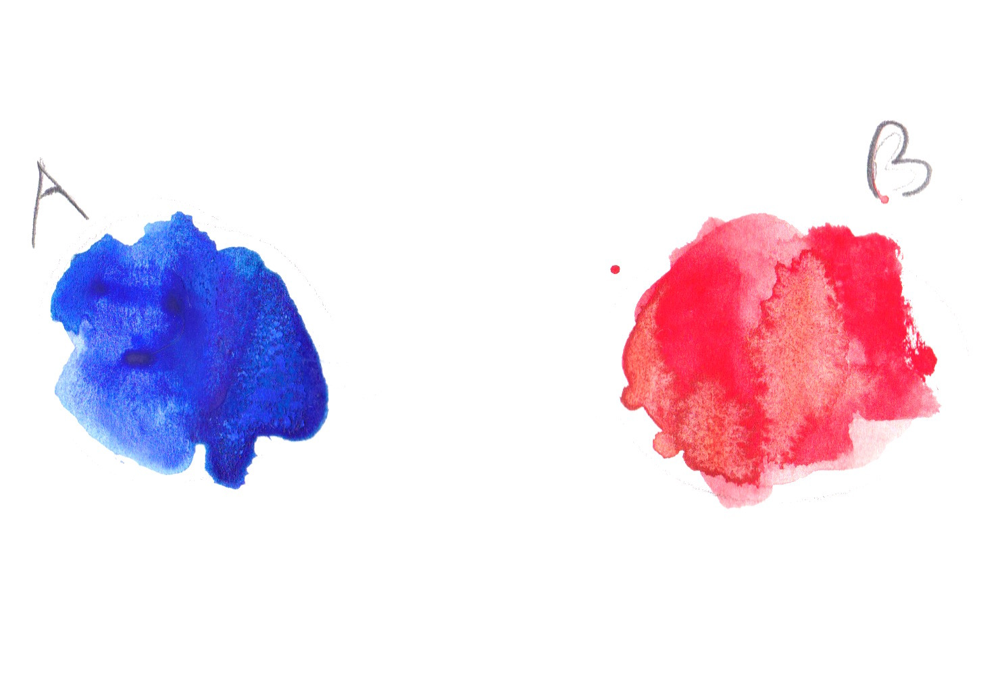

## Image operations

Below you will see some examples with images where you can play around and uncomment some lines to see the corresponding results.

### Invert

<div class="codeAndCanvas" data="inv.frag" data-textures="00.jpg,01.jpg"></div>

```glsl
// Author @patriciogv - 2015
// http://patriciogonzalezvivo.com

#ifdef GL_ES
precision mediump float;
#endif

uniform sampler2D u_tex0;

uniform float u_time;
uniform vec2 u_mouse;
uniform vec2 u_resolution;

void main (void) {
    vec2 st = gl_FragCoord.xy/u_resolution.xy;
    vec3 color = texture2D(u_tex0,st).rgb;

    // color = 1.0-color;

    gl_FragColor = vec4(color,1.0);
}
```

### Add, Subtract, Multiply and others


<div class="codeAndCanvas" data="operations.frag" data-textures="00.jpg,01.jpg"></div>

```glsl
// Author @patriciogv - 2015
// http://patriciogonzalezvivo.com

#ifdef GL_ES
precision mediump float;
#endif

uniform sampler2D u_tex0;
uniform sampler2D u_tex1;

uniform float u_time;
uniform vec2 u_mouse;
uniform vec2 u_resolution;

void main (void) {
    vec2 st = gl_FragCoord.xy/u_resolution.xy;
    vec3 color = vec3(0.);
    vec3 colorA = texture2D(u_tex0,st).rgb;
    vec3 colorB = texture2D(u_tex1,st).rgb;

    color = colorA+colorB;      // Add
    // color = colorA-colorB;      // Diff
    // color = abs(colorA-colorB); // Abs Diff
    // color = colorA*colorB;      // Mult
    // color = colorA/colorB;      // Div
    // color = max(colorA,colorB); // Ligther
    // color = min(colorA,colorB); // Darker

    gl_FragColor = vec4(color,1.0);
}
```

### PS Blending modes



<div class="codeAndCanvas" data="blend.frag" data-textures="04.jpg,05.jpg"></div>

```glsl
#ifdef GL_ES
precision mediump float;
#endif

#define BlendLinearDodgef               BlendAddf
#define BlendLinearBurnf                BlendSubstractf
#define BlendAddf(base, blend)          min(base + blend, 1.0)
#define BlendSubstractf(base, blend)    max(base + blend - 1.0, 0.0)
#define BlendLightenf(base, blend)      max(blend, base)
#define BlendDarkenf(base, blend)       min(blend, base)
#define BlendLinearLightf(base, blend)  (blend < 0.5 ? BlendLinearBurnf(base, (2.0 * blend)) : BlendLinearDodgef(base, (2.0 * (blend - 0.5))))
#define BlendScreenf(base, blend)       (1.0 - ((1.0 - base) * (1.0 - blend)))
#define BlendOverlayf(base, blend)      (base < 0.5 ? (2.0 * base * blend) : (1.0 - 2.0 * (1.0 - base) * (1.0 - blend)))
#define BlendSoftLightf(base, blend)    ((blend < 0.5) ? (2.0 * base * blend + base * base * (1.0 - 2.0 * blend)) : (sqrt(base) * (2.0 * blend - 1.0) + 2.0 * base * (1.0 - blend)))
#define BlendColorDodgef(base, blend)   ((blend == 1.0) ? blend : min(base / (1.0 - blend), 1.0))
#define BlendColorBurnf(base, blend)    ((blend == 0.0) ? blend : max((1.0 - ((1.0 - base) / blend)), 0.0))
#define BlendVividLightf(base, blend)   ((blend < 0.5) ? BlendColorBurnf(base, (2.0 * blend)) : BlendColorDodgef(base, (2.0 * (blend - 0.5))))
#define BlendPinLightf(base, blend)     ((blend < 0.5) ? BlendDarkenf(base, (2.0 * blend)) : BlendLightenf(base, (2.0 *(blend - 0.5))))
#define BlendHardMixf(base, blend)      ((BlendVividLightf(base, blend) < 0.5) ? 0.0 : 1.0)
#define BlendReflectf(base, blend)      ((blend == 1.0) ? blend : min(base * base / (1.0 - blend), 1.0))

// Component wise blending
#define Blend(base, blend, funcf)       vec3(funcf(base.r, blend.r), funcf(base.g, blend.g), funcf(base.b, blend.b))

#define BlendNormal(base, blend)        (blend)
#define BlendLighten                    BlendLightenf
#define BlendDarken                     BlendDarkenf
#define BlendMultiply(base, blend)      (base * blend)
#define BlendAverage(base, blend)       ((base + blend) / 2.0)
#define BlendAdd(base, blend)           min(base + blend, vec3(1.0))
#define BlendSubstract(base, blend)     max(base + blend - vec3(1.0), vec3(0.0))
#define BlendDifference(base, blend)    abs(base - blend)
#define BlendNegation(base, blend)      (vec3(1.0) - abs(vec3(1.0) - base - blend))
#define BlendExclusion(base, blend)     (base + blend - 2.0 * base * blend)
#define BlendScreen(base, blend)        Blend(base, blend, BlendScreenf)
#define BlendOverlay(base, blend)       Blend(base, blend, BlendOverlayf)
#define BlendSoftLight(base, blend)     Blend(base, blend, BlendSoftLightf)
#define BlendHardLight(base, blend)     BlendOverlay(blend, base)
#define BlendColorDodge(base, blend)    Blend(base, blend, BlendColorDodgef)
#define BlendColorBurn(base, blend)     Blend(base, blend, BlendColorBurnf)
#define BlendLinearDodge                BlendAdd
#define BlendLinearBurn                 BlendSubstract

#define BlendLinearLight(base, blend)   Blend(base, blend, BlendLinearLightf)
#define BlendVividLight(base, blend)    Blend(base, blend, BlendVividLightf)
#define BlendPinLight(base, blend)      Blend(base, blend, BlendPinLightf)
#define BlendHardMix(base, blend)       Blend(base, blend, BlendHardMixf)
#define BlendReflect(base, blend)       Blend(base, blend, BlendReflectf)
#define BlendGlow(base, blend)          BlendReflect(blend, base)
#define BlendPhoenix(base, blend)       (min(base, blend) - max(base, blend) + vec3(1.0))
#define BlendOpacity(base, blend, F, O) (F(base, blend) * O + blend * (1.0 - O))

uniform sampler2D u_tex0;
uniform sampler2D u_tex1;

uniform float u_time;
uniform vec2 u_mouse;
uniform vec2 u_resolution;

void main (void) {
    vec2 st = gl_FragCoord.xy/u_resolution.xy;
    vec3 color = vec3(0.0);

    vec3 colorA = texture2D(u_tex0,st).rgb;
    vec3 colorB = texture2D(u_tex1,st).rgb;

    color = BlendMultiply(colorA,colorB);
    // color = BlendAdd(colorA,colorB);
    // color = BlendLighten(colorA,colorB);
    // color = BlendDarken(colorA,colorB);
    // color = BlendAverage(colorA,colorB);
    // color = BlendSubstract(colorA,colorB);
    // color = BlendDifference(colorA,colorB);
    // color = BlendNegation(colorA,colorB);
    // color = BlendExclusion(colorA,colorB);
    // color = BlendScreen(colorA,colorB);
    // color = BlendOverlay(colorA,colorB);
    // color = BlendSoftLight(colorA,colorB);
    // color = BlendHardLight(colorA,colorB);
    // color = BlendColorDodge(colorA,colorB);
    // color = BlendColorBurn(colorA,colorB);
    // color = BlendLinearLight(colorA,colorB);
    // color = BlendVividLight(colorA,colorB);
    // color = BlendPinLight(colorA,colorB);
    // color = BlendHardMix(colorA,colorB);
    // color = BlendReflect(colorA,colorB);
    // color = BlendGlow(colorA,colorB);
    // color = BlendPhoenix(colorA,colorB);

    gl_FragColor = vec4(color,1.0);
}
```